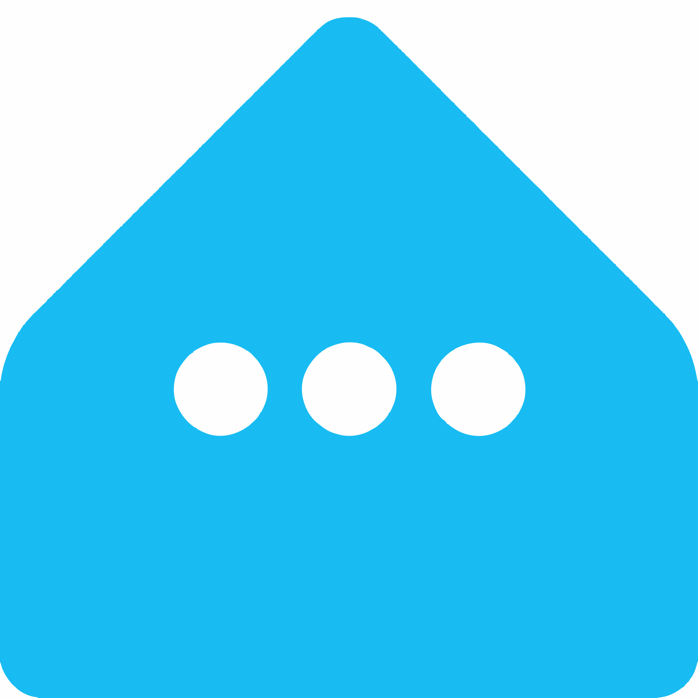
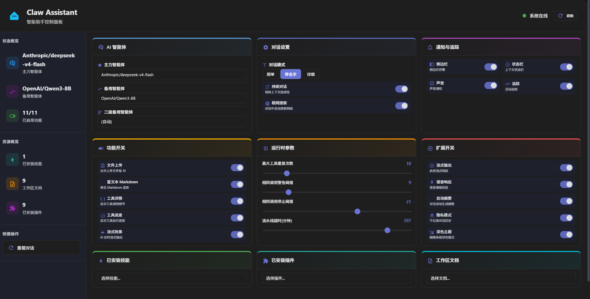

<div align="center">



# Claw Plus

**Configuration Dashboard for Claw Assistant on Home Assistant**

[](https://github.com/hacs/integration)

</div>

---

Claw Plus 是 [Claw Assistant](https://github.com/ha-china/ha_claw) 的增强型配置管理集成。通过传感器实时暴露所有配置项，通过服务即时修改，并内置全功能可交互控制面板——无需进入集成配置流，仪表盘上即可掌控一切。

## Feature Overview

| Feature | Description |
|---------|-------------|
| **Configuration Sensor** | 30+ attributes exposing all Claw Assistant settings + workspace resource counts |
| **Instant Config Update** | Modify any option via service call, takes effect immediately |
| **Workspace Browser** | List skills, docs, plugins with a single service call |
| **File Editor** | Read and write workspace files directly from HA |
| **Built-in Dashboard** | Full interactive panel powered by [html-pro-card](https://github.com/ha-china/html-card-pro) |
| **Path Traversal Protection** | All file access confined to Claw workspace, no escape |

---

## Installation

### HACS (Recommended)

1. Open HACS → Integrations
2. Click ⋮ in the top right → Custom repositories
3. Add `https://github.com/C3H3-AI/ha-claw-plus`
4. Search for "Claw Plus" and install
5. Restart Home Assistant

### Manual Installation

1. Copy the `custom_components/claw_plus/` directory to your HA `custom_components/` directory
2. Restart Home Assistant

### Configuration

1. Go to **Settings → Devices & Services → Add Integration**
2. Search for "Claw Plus" and add
3. The integration auto-registers — no extra config needed

---

## Sensor Attributes

The `sensor.claw_dashboard_config_claw_config` entity exposes 30+ attributes:

### AI & Agent

| Attribute | Type | Description |
|-----------|------|-------------|
| `primary_agent` | string | Main conversation AI entity |
| `fallback_agent` | string | Auto-switch when primary unavailable |
| `secondary_fallback_agent` | string | Optional third agent for aggregation |
| `proxy_mode` | string | Proxy address (127.0.0.1:7890 / 10809 / socks5:10808) |

### Conversation

| Attribute | Type | Description |
|-----------|------|-------------|
| `conversation_mode` | select | `no_name` / `add_name` / `detailed` |
| `continuous_conversation` | bool | Keep context without interruption |
| `enable_web_search` | bool | Auto search the web in conversations |
| `enable_streaming_effect` | bool | Real-time streaming output |
| `enable_file_upload` | bool | Allow uploading files to AI |
| `enable_rich_markdown` | bool | Enhanced Markdown rendering |
| `image_generation` | bool | Allow AI to generate images |
| `voice_interaction` | bool | Enable voice input/output |
| `debug_mode` | bool | Show debug information |

### Feature Toggles

| Attribute | Type | Description |
|-----------|------|-------------|
| `enable_tool_details` | bool | Show tool call details |
| `enable_tool_progress` | bool | Show tool execution progress |
| `enable_sidebar_dock` | bool | Show Claw sidebar dock |
| `enable_context_status_bar` | bool | Show context status bar |
| `enable_activity_tracking` | bool | Track user activity |
| `enable_sound_notifications` | bool | Sound notifications |

### Workspace Resources

| Attribute | Type | Description |
|-----------|------|-------------|
| `workspace_documents_count` | int | Number of workspace documents |
| `workspace_skills_count` | int | Number of installed skills |
| `workspace_plugins_count` | int | Number of installed plugins |
| `workspace_documents_list` | list | List of workspace document names |
| `workspace_skills_list` | list | List of installed skill names |
| `workspace_plugins_list` | list | List of installed plugin names |

---

## Services

### `claw_plus.set_option`

Modify any Claw Assistant configuration option. Changes take effect immediately.

| Parameter | Type | Required | Description |
|-----------|------|----------|-------------|
| `key` | string | ✅ | Attribute name (e.g. `enable_web_search`) |
| `value` | string | ✅ | New value (e.g. `true`, `detailed`) |

### `claw_plus.refresh_sensor`

Force refresh the sensor state from Claw Assistant config.

> No parameters required.

### `claw_plus.list_workspace`

List workspace resources by category.

| Parameter | Type | Required | Description |
|-----------|------|----------|-------------|
| `category` | select | ✅ | `skills` / `docs` / `plugins` / `all` |

### `claw_plus.read_workspace_file`

Read a file from the Claw workspace.

| Parameter | Type | Required | Description |
|-----------|------|----------|-------------|
| `path` | string | ✅ | Relative path within workspace (e.g. `SOUL.md`) |

### `claw_plus.write_workspace_file`

Write content to a file in the Claw workspace.

| Parameter | Type | Required | Description |
|-----------|------|----------|-------------|
| `path` | string | ✅ | Relative path within workspace |
| `content` | string | ✅ | File content to write |

---

## Dashboard



### Option 1: Full Panel

```yaml
type: custom:html-pro-card
do_not_parse: true
content: !include custom_components/claw_plus/dashboard.html
```

### Option 2: Compact Card

A lightweight card for dashboard sidebars. Copy the YAML below directly into a new card:

```yaml
type: custom:html-pro-card
do_not_parse: true
content: |
  <style>
    * { box-sizing: border-box; }
    :root {
      --cbg: var(--ha-card-background, var(--card-background-color, #fff));
      --ctxt: var(--primary-text-color, #1c1c1e);
      --csec: var(--secondary-text-color, #8e8e93);
      --cacc: var(--accent-color, #007aff);
      --cbd: var(--divider-color, rgba(60,60,67,0.12));
      --cr: 12px;
    }
    .app { padding: 20px; font-family: -apple-system, BlinkMacSystemFont, 'Segoe UI', sans-serif; color: var(--ctxt); }
    .app h1 { font-size: 22px; font-weight: 700; margin: 0 0 20px; display: flex; align-items: center; gap: 10px; letter-spacing: -0.3px; }
    .app h1 span.status { font-size: 12px; font-weight: 400; color: var(--csec); }
    .grid2 { display: grid; grid-template-columns: 1fr 1fr; gap: 14px; margin-bottom: 14px; }
    @media (max-width: 700px) { .grid2 { grid-template-columns: 1fr; } }
    .card { background: var(--cbg); border: 1px solid var(--cbd); border-radius: var(--cr); padding: 16px; }
    .card + .card { margin-top: 14px; }
    .card-title { font-size: 11px; font-weight: 600; color: var(--csec); text-transform: uppercase; letter-spacing: 0.7px; margin-bottom: 12px; display: flex; align-items: center; gap: 6px; }
    .row { display: flex; align-items: center; justify-content: space-between; padding: 9px 0; gap: 12px; }
    .row + .row { border-top: 1px solid var(--cbd); }
    .rl { min-width: 0; flex: 1; }
    .rn { font-size: 14px; font-weight: 500; }
    .rd { font-size: 11px; color: var(--csec); margin-top: 1px; }
    .rc { flex-shrink: 0; display: flex; align-items: center; gap: 8px; }
    select.rc { font-size: 13px; border-radius: 8px; border: 1px solid var(--cbd); background: var(--cbg); color: var(--ctxt); padding: 6px 28px 6px 10px; cursor: pointer; max-width: 190px; -webkit-appearance: none; appearance: none; background-image: url("data:image/svg+xml,%3Csvg xmlns='http://www.w3.org/2000/svg' width='10' height='6'%3E%3Cpath d='M0 0l5 6 5-6z' fill='%238e8e93'/%3E%3C/svg%3E"); background-repeat: no-repeat; background-position: right 8px center; }
    .tog { position: relative; width: 42px; height: 24px; cursor: pointer; display: inline-block; flex-shrink: 0; }
    .tog input { opacity: 0; width: 0; height: 0; position: absolute; }
    .tog-track { position: absolute; inset: 0; background: #e9e9ea; border-radius: 12px; transition: .25s; }
    .tog input:checked + .tog-track { background: var(--cacc); opacity: .85; }
    .tog-knob { position: absolute; top: 2px; left: 2px; width: 20px; height: 20px; background: #fff; border-radius: 50%; transition: .25s cubic-bezier(.4,0,.2,1); box-shadow: 0 1px 3px rgba(0,0,0,.15); }
    .tog input:checked + .tog-track .tog-knob { transform: translateX(18px); }
    .btn-group { display: flex; gap: 4px; }
    .btn-group button { padding: 5px 14px; border: 1px solid var(--cbd); border-radius: 8px; background: transparent; color: var(--ctxt); font-size: 12px; cursor: pointer; transition: .15s; }
    .btn-group button.active { background: var(--cacc); color: #fff; border-color: var(--cacc); }
    .btn-group button:hover:not(.active) { border-color: var(--cacc); }
    .tog-grid { display: grid; grid-template-columns: 1fr 1fr; gap: 8px; }
    @media (max-width: 700px) { .tog-grid { grid-template-columns: 1fr; } }
    .tog-cell { display: flex; align-items: center; justify-content: space-between; background: var(--cbg); border: 1px solid var(--cbd); border-radius: 10px; padding: 10px 12px; }
    .tog-cell .rn { font-size: 13px; }
    .tog-cell .rd { font-size: 10px; }
    .info-grid { display: grid; grid-template-columns: 1fr 1fr 1fr; gap: 14px; }
    @media (max-width: 700px) { .info-grid { grid-template-columns: 1fr; } }
    .info-card { background: var(--cbg); border: 1px solid var(--cbd); border-radius: var(--cr); padding: 14px; }
    .info-card .count { font-size: 28px; font-weight: 700; color: var(--cacc); line-height: 1; margin-bottom: 4px; }
    .info-card .label { font-size: 13px; font-weight: 500; margin-bottom: 6px; }
    .info-card .items { font-size: 11px; color: var(--csec); line-height: 1.6; }
    .info-card .items span { display: inline-block; background: var(--cbd); border-radius: 4px; padding: 1px 6px; margin: 1px 2px; font-size: 10px; }
    .ftr { text-align: center; font-size: 11px; color: var(--csec); padding-top: 14px; margin-top: 14px; border-top: 1px solid var(--cbd); }
  </style>
  <div class="app" id="root">
    <h1>&#x1F916; Claw Assistant <span class="status" id="status"></span></h1>
    <div id="body">Loading...</div>
  </div>
  <script>
    var R = document.querySelector('html-pro-card') || document.querySelector('ha-card') || document.body;
    R.SENSOR = 'sensor.claw_dashboard_config_claw_config';
    R._watchedEntities = [R.SENSOR, 'sensor.'];
    function b(v) { return v === true || v === 'true' || v === 1 || v === '1'; }
    function setOpt(k, v) {
      if (typeof v === 'boolean') v = v ? 'true' : 'false';
      R.callService('claw_plus', 'set_option', { key: k, value: v });
    }
    R._onHassUpdate = function(hass) {
      var st = hass.states[R.SENSOR];
      if (!st || !st.attributes) { return; }
      var o = st.attributes;
      document.getElementById('status').textContent = '• ' + new Date().toLocaleTimeString('zh-CN', { hour: '2-digit', minute: '2-digit' });
      var agents = Object.keys(hass.states).filter(function(e) { return e.startsWith('conversation.') && e !== 'conversation.claw_assistant'; });
      function agentOpts(sel) {
        return agents.map(function(a) { return '<option value="' + a + '"' + (sel === a ? ' selected' : '') + '>' + a.replace('conversation.', '') + '</option>'; }).join('');
      }
      var convModes = [['no_name','Simple'],['add_name','Named'],['detailed','Detailed']];
      var toggles = [
        ['enable_web_search','Web Search','Auto search the web in conversations'],
        ['enable_streaming_effect','Streaming','Real-time streaming output'],
        ['enable_file_upload','File Upload','Allow uploading files to AI'],
        ['enable_rich_markdown','Rich MD','Enhanced Markdown rendering'],
        ['enable_tool_details','Tool Details','Show tool call details'],
        ['enable_tool_progress','Tool Progress','Show tool execution progress'],
        ['enable_sidebar_dock','Sidebar','Show Claw sidebar dock'],
        ['enable_context_status_bar','Status Bar','Show context status bar'],
        ['enable_activity_tracking','Activity','Track user activity'],
        ['enable_sound_notifications','Sound','Sound notifications']
      ];
      var wsDocs = ['AGENTS','BOOTSTRAP','HEARTBEAT','IDENTITY','MEMORY','SOUL','TOOLS','USER'];
      var skills = ['automation-patterns','homeassistant_runtime_guide'];
      var plugins = [];
      var h = '';
      h += '<div class="grid2">';
      h += '<div class="card"><div class="card-title">🤖 AI Agent</div>';
      h += '<div class="row"><div class="rl"><div class="rn">Primary Agent</div><div class="rd">Main conversation AI</div></div><select class="rc" onchange="setOpt(\'primary_agent\',this.value)">' + agentOpts(o.primary_agent || '') + '</select></div>';
      h += '<div class="row"><div class="rl"><div class="rn">Fallback Agent</div><div class="rd">Auto-switch when primary unavailable</div></div><select class="rc" onchange="setOpt(\'fallback_agent\',this.value)">' + agentOpts(o.fallback_agent || '') + '</select></div>';
      h += '<div class="row"><div class="rl"><div class="rn">Third Agent</div><div class="rd">Optional, for aggregation mode</div></div><select class="rc" onchange="setOpt(\'secondary_fallback_agent\',this.value)"><option value="">(Disabled)</option>' + agentOpts(o.secondary_fallback_agent || '') + '</select></div>';
      h += '</div>';
      h += '<div class="card"><div class="card-title">💬 Conversation</div>';
      h += '<div class="row"><div class="rl"><div class="rn">Mode</div></div><div class="btn-group">';
      convModes.forEach(function(m) {
        h += '<button class="' + (o.conversation_mode === m[0] ? 'active' : '') + '" onclick="setOpt(\'conversation_mode\',\'' + m[0] + '\'); this.parentElement.querySelectorAll(\'button\').forEach(function(b){b.classList.remove(\'active\')}); this.classList.add(\'active\')">' + m[1] + '</button>';
      });
      h += '</div></div>';
      h += '<div class="row"><div class="rl"><div class="rn">Web Search</div></div><label class="tog"><input type="checkbox" ' + (b(o.enable_web_search)?'checked':'') + ' onchange="setOpt(\'enable_web_search\',this.checked)"><span class="tog-track"><span class="tog-knob"></span></span></label></div>';
      h += '<div class="row"><div class="rl"><div class="rn">Continuous</div><div class="rd">Keep context without interruption</div></div><label class="tog"><input type="checkbox" ' + (b(o.continuous_conversation)?'checked':'') + ' onchange="setOpt(\'continuous_conversation\',this.checked)"><span class="tog-track"><span class="tog-knob"></span></span></label></div>';
      h += '<div class="row"><div class="rl"><div class="rn">Streaming Effect</div></div><label class="tog"><input type="checkbox" ' + (b(o.enable_streaming_effect)?'checked':'') + ' onchange="setOpt(\'enable_streaming_effect\',this.checked)"><span class="tog-track"><span class="tog-knob"></span></span></label></div>';
      h += '</div></div>';
      h += '</div>';
      h += '<div class="card"><div class="card-title">⚙️ Feature Toggles</div><div class="tog-grid">';
      toggles.forEach(function(t) {
        h += '<div class="tog-cell"><div class="rl"><div class="rn">' + t[1] + '</div><div class="rd">' + t[2] + '</div></div><label class="tog"><input type="checkbox" ' + (b(o[t[0]])?'checked':'') + ' onchange="setOpt(\'' + t[0] + '\',this.checked)"><span class="tog-track"><span class="tog-knob"></span></span></label></div>';
      });
      h += '</div></div>';
      h += '<div class="info-grid">';
      h += '<div class="info-card"><div class="count">' + wsDocs.length + '</div><div class="label">📄 Workspace Docs</div><div class="items">' + wsDocs.map(function(d){return '<span>'+d+'</span>';}).join(' ') + '</div></div>';
      h += '<div class="info-card"><div class="count">' + skills.length + '</div><div class="label">🌟 Skills</div><div class="items">' + skills.map(function(s){return '<span>'+s+'</span>';}).join(' ') + '</div></div>';
      h += '<div class="info-card"><div class="count">' + plugins.length + '</div><div class="label">🔗 Plugins</div><div class="items">' + (plugins.length?plugins.map(function(p){return '<span>'+p+'</span>';}).join(' '):'None') + '</div></div>';
      h += '</div>';
      h += '<div class="ftr">⚡ Changes take effect instantly · Edit workspace/skills/plugins in Claw Assistant config flow · Claw Plus v1.1.0</div>';
      document.getElementById('body').innerHTML = h;
    };
  </script>
```

> Also available as a standalone file: [`docs/claw_dashboard_card.yaml`](docs/claw_dashboard_card.yaml)

---

## Automation Examples

### Toggle web search on schedule

```yaml
automation:
  - alias: "Enable web search in morning"
    trigger:
      - platform: time
        at: "08:00:00"
    action:
      - service: claw_plus.set_option
        data:
          key: enable_web_search
          value: "true"
```

### List workspace resources

```yaml
service: claw_plus.list_workspace
data:
  category: all
```

### Read a workspace file

```yaml
service: claw_plus.read_workspace_file
data:
  path: SOUL.md
```

### Write to a workspace file

```yaml
service: claw_plus.write_workspace_file
data:
  path: notes.md
  content: |
    # My Notes
    Some content here
```

---

## Security

| Measure | Description |
|---------|-------------|
| **Path Traversal Protection** | All `read_workspace_file` / `write_workspace_file` paths are confined to the Claw workspace directory — `../` escapes are blocked |
| **Input Validation** | `set_option` only accepts predefined attribute keys; unknown keys are rejected |
| **No Remote Access** | All operations are local to the HA instance; no data is sent externally |

---

## Dependencies

| Dependency | Version | Purpose |
|------------|---------|---------|
| Home Assistant | ≥ 2025.1 | Core platform |
| [Claw Assistant](https://github.com/ha-china/ha_claw) | any | AI conversation integration |
| [html-pro-card](https://github.com/ha-china/html-card-pro) | any | Dashboard card renderer (optional) |

---

## Changelog

| Version | Date | Changes |
|---------|------|---------|
| 1.3.1 | 2026-07-10 | fix sidebar icon (mdi:claw → mdi:robot-happy); restore localStorage for FAB hide/show + panel toggle state |
| 1.1.0 | 2026-05-29 | Added `list_workspace` / `read_workspace_file` / `write_workspace_file` services; embedded dashboard card |
| 1.0.0 | 2026-05-28 | Initial release: `sensor.claw_config` + `set_option` service |
